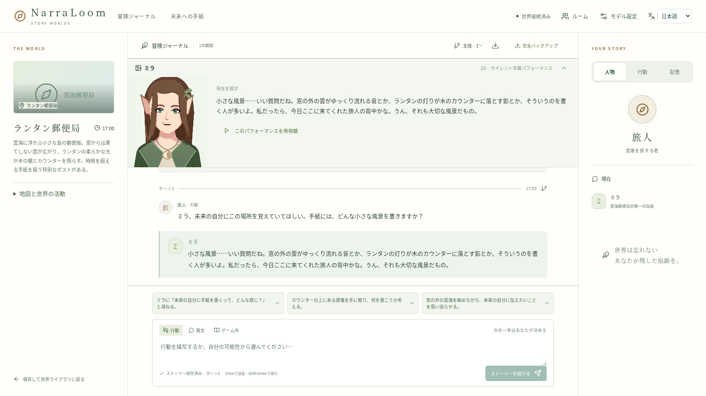

# NarraLoom · 叙织

[English](README.md) · [简体中文](README.zh-CN.md) · [日本語](README.ja.md)

**世界を織り、物語を紡ぐ。**

NarraLoom は、物語ゲームのためのモジュール式 AI フレームワークです。舞台の構想から場所や登場人物を生成し、一つの世界で複数のストーリーを作れます。プレイヤーは会話と行動で冒険を進め、エンジンが知識、アイテム、時間、行動の結果を記録します。

Python バックエンドを単独で動かす、自分のアプリに組み込む、明るい配色のリファレンスフロントエンドで試す、といった使い方ができます。創作、行動計画、キャラクターの会話、ナレーション、意味判断に使うモデルは、ローカルサービス、API、Python アダプターで個別に設定できます。

**フレームワークを知る：** [図解ツアー](guides/ja/features.md) · [クイックスタート](guides/ja/quickstart.md)

https://github.com/user-attachments/assets/fbe1185d-3d95-4df1-9db8-337ab7a2a19e

[](guides/ja/features.md)

## はじめに

| 目的 | ガイド |
| --- | --- |
| API またはローカルモデルを設定して遊ぶ | [クイックスタート](guides/ja/quickstart.md) |
| Codex や Claude Code にセットアップを任せる | [AI によるセットアップ](guides/ja/ai-setup.md) |
| 世界、ストーリー、共有パッケージを作る | [クリエイター向け](guides/ja/creators.md) |
| 独自のフロントエンドやゲームを開発する | [開発者向け](guides/ja/developers.md) · [Python SDK](guides/reference/client.md) |
| モデルを入れ替えて性能を比較する | [研究者向け](guides/ja/research.md) · [モデルの選択](guides/ja/models.md) |
| サーバーの運用、バックアップ、問題解決 | [デプロイ](guides/ja/deployment.md) |

## 創作・プレイ・拡張

- **一つの世界、複数の物語。** 単一シーン、短編、探索型の冒険を生成。設定とあらすじを編集し、プレイ前に自動検証と独立したセーブでのモデル試走を行います。
- **積み重なる行動の結果。** 型付きルールで移動、所持品、資源、時計、独自状態を管理。イベント記録から再生、分岐、復元ができます。
- **それぞれの視点。** NPC とプレイヤーごとに知識と見える履歴を分離。マルチプレイでは独立キャラクター、内緒話、合意に基づく取引を扱えます。
- **共有できる創作物。** 世界とストーリーをネイティブ形式で書き出し、セルフホストの本棚で共有。受け取った人が編集可能なコピーを作り、自分のモデルで検証します。基本的なキャラクターカードとワールドブックの読み込みにも対応します。
- **交換可能なエンジン。** 生成モデルをモジュールごとに設定。System One/Jev 判断アダプターも選択でき、計算、所有権、イベント確定は決定的なルールが処理します。
- **Python のゲームルール。** 独自の行動とキャラクター別・共有状態を追加。自動テスト、持ち運べるセーブ、バージョン固定に対応します。
- **動く NPC。** 主要人物に持ち運べる 2D 立ち絵を割り当て、確定した台詞から表情、動作、無音の字幕演技を表示します。
- **3 言語のインターフェース。** 英語、簡体字中国語、日本語に対応。作品の言語は作者が別に選びます。

## インストール

Linux / Windows WSL2 は Python 3.11+ と Node.js 20+ を使用します。macOS と Docker Desktop は[コンテナー手順](guides/ja/quickstart.md)を参照してください。テキスト NPC はモデル API で生成し、画像から動く立ち絵を作る場合は[ローカルモデルと作成環境](guides/ja/avatars.md)を使います。ミラー取得コマンドも用意しています。

```bash
git clone https://github.com/Toyhom/NarraLoom.git
cd NarraLoom
python3 -m venv .venv
source .venv/bin/activate
python -m pip install -e .
npm ci
npm run build
narraloom serve --workspace . --web-dist web/dist
```

**http://localhost:18090** を開き、モデル設定画面で接続先とモデル ID を入力し、保存して接続を確認します。その後、世界の作成を選びます。[クイックスタート](guides/ja/quickstart.md)にバックエンド単独のインストールと設定ファイルの使い方もあります。

Python 配布名は `roleplay-world`、インポート名は `roleplay_world`、コマンドは `narraloom` です。オリジナルコードは [MIT](LICENSE)。第三者のソースと素材の条件は [NOTICE](NOTICE.md)をご覧ください。
