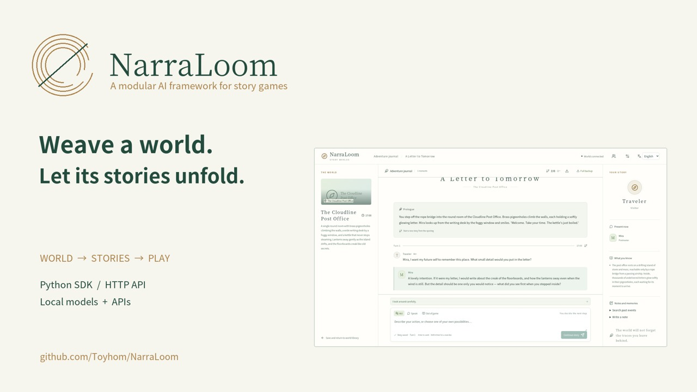

# NarraLoom · 叙织

[English](README.md) · [简体中文](README.zh-CN.md) · [日本語](README.ja.md)

**Weave a world. Let its stories unfold.**

NarraLoom is a modular AI framework for story games. Describe a setting, generate its places and characters, and create several stories in the same world. Players shape each adventure through conversation and action, while the engine tracks knowledge, items, time and consequences.

Use the Python backend on its own, embed it in an application, or explore it through the light reference frontend. Models for creation, planning, dialogue, narration and semantic decisions can be configured separately through local services, APIs or Python adapters.

[](https://github.com/Toyhom/NarraLoom/releases/download/v0.14.0/narraloom-en.mp4)

**Watch the tour:** [English](https://github.com/Toyhom/NarraLoom/releases/download/v0.14.0/narraloom-en.mp4) · [简体中文](https://github.com/Toyhom/NarraLoom/releases/download/v0.14.0/narraloom-zh-CN.mp4) · [日本語](https://github.com/Toyhom/NarraLoom/releases/download/v0.14.0/narraloom-ja.mp4)

## Start here

| Your goal | Guide |
| --- | --- |
| Configure an API or local model and play | [Quick start](guides/quickstart.md) |
| Ask Codex or Claude Code to set it up | [AI-assisted setup](guides/ai-setup.md) |
| Create worlds, stories and reusable packages | [Creator guide](guides/creators.md) |
| Build your own frontend or game | [Developer guide](guides/developers.md) · [Python SDK](docs/CLIENT.md) |
| Replace models and compare their behavior | [Research guide](guides/research.md) · [Model selection](guides/models.md) |
| Run, back up and troubleshoot a server | [Deployment](guides/deployment.md) |

## Create, play and extend

- **One world, many stories.** Generate a scene, a short story or an exploration adventure. Edit the setting and outlines; automatic checks and isolated model playtests run before play.
- **Persistent consequences.** Typed rules govern movement, inventory, resources, clocks and custom state. Saved events support replay, history branches and recovery.
- **Characters with perspectives.** NPCs and players receive their own knowledge and visible history. Multiplayer rooms support separate characters, private conversations and explicit trades.
- **Reusable content.** Export native world/story packages, share through a self-hosted shelf, and install editable copies. Recipients test with their own models. Basic character-card and world-book import is also available.
- **Replaceable engines.** Bind each generation module independently. Optional System One/Jev decision adapters support evaluated fast paths. Deterministic rules handle arithmetic, ownership and event commits.
- **Optional animated NPCs.** Bind portable 2D portrait assets to important characters; committed dialogue drives expressions, motion and silent subtitles.
- **Three interface languages.** English, Simplified Chinese and Japanese. Authors choose the language of their worlds separately.

## Install

Requires Python 3.11+. The reference frontend also uses Node.js 20+.

```bash
git clone https://github.com/Toyhom/NarraLoom.git
cd NarraLoom
python -m venv .venv
source .venv/bin/activate
python -m pip install -e '.[dev]'
npm ci
npm run build
narraloom serve --workspace . --web-dist web/dist
```

Open **http://localhost:18090**, open **Models & usage**, enter your provider endpoint and model ID, save and test the connection. Then choose **Create my world**. [Quick start](guides/quickstart.md) includes headless installation and configuration files.

The Python distribution and import namespace are `roleplay-world` and `roleplay_world`; the installed command is `narraloom`. Original framework code is [MIT](LICENSE). Third-party sources and resource terms are in [NOTICE](NOTICE.md).
