# NarraLoom in pictures

[English](features.md) · [简体中文](zh-CN/features.md) · [日本語](ja/features.md)

Build a small conversation scene, an interactive story or a tabletop-style adventure with the same modular backend. This tour follows the reference frontend from a world idea to play, sharing and model research. Open any screenshot to see its full size.

| Explore | In the 4:10 video |
| --- | --- |
| [Connect a model](#connect) · [Create and test](#create) | 0:04 · 0:14 |
| [Worlds and stories](#worlds) · [Editing](#author) | 0:34 |
| [NPCs and dialogue](#play) · [Memory and branches](#memory) | 1:03 |
| [Rules](#rules) · [World activity](#simulation) · [Custom state](#state) | 1:33 |
| [Multiplayer](#rooms) · [Sharing and recovery](#share) | 2:27 · 2:43 |
| [Model modules](#engines) · [Backend and research](#build) | 3:08 · 3:35 |

[Watch the video](../README.md) · [Install and try it](quickstart.md)

## Connect a local model or API

Open **Models & usage**, choose a provider protocol, enter the endpoint and model ID, then save and test the connection. A shared default gets you started; individual modules can use different models later. The interface supports English, Simplified Chinese and Japanese. The world's content language is selected separately.

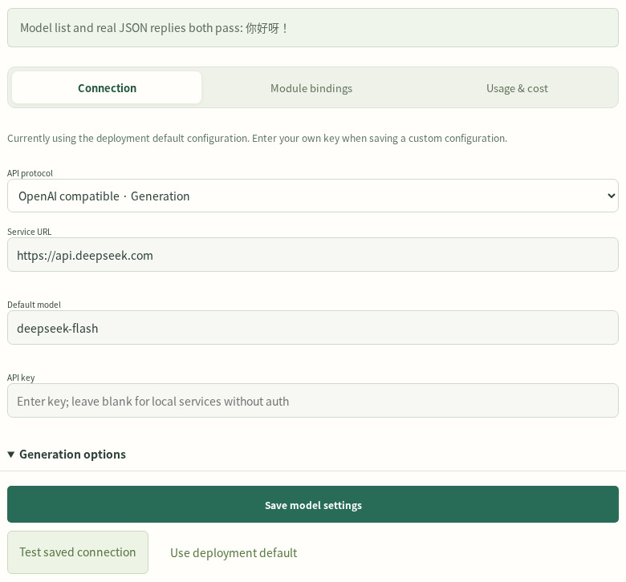

Continue with [model selection](models.md) or [AI-assisted setup](ai-setup.md).

## Describe a world; receive playable, tested content

Choose **Create my world** and describe the setting and first story. Start with one scene and one NPC, a short story, or a larger adventure. Optional rules, world activity, custom state and 2D portraits can be selected during creation. The engine builds editable places, characters and story content, then runs structural checks, rule checks and model playtests in a separate save.

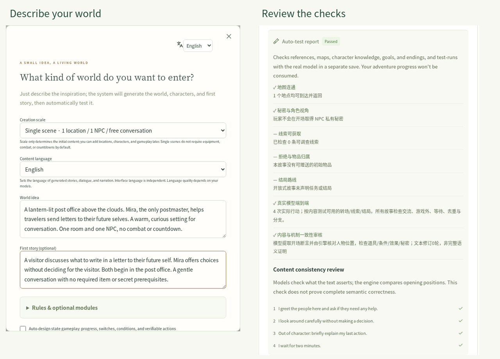

The report belongs to the tested revision. Review its results, edit the content or request AI revision and retest. [Creator guide](creators.md).

## Give one world several stories

A world holds shared places and recurring characters. Each story adds its own premise, player role, opening and outline; each campaign saves a particular playthrough. Open a world and choose **New story** to generate another adventure in the same setting. The screenshot shows two independently tested stories in one world.

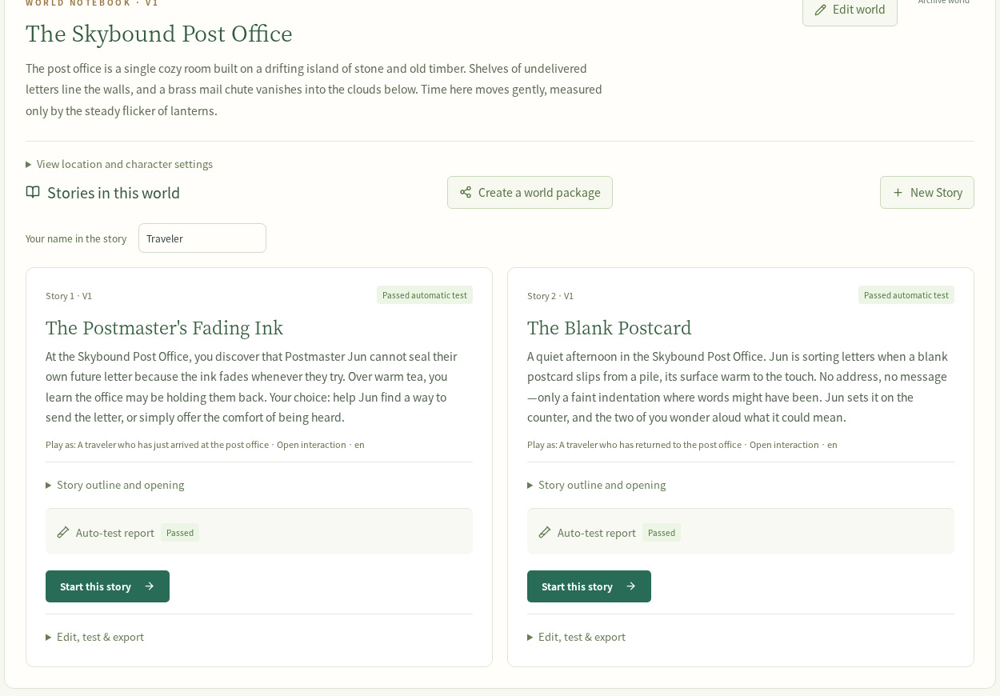

You can start a story independently or carry eligible consequences from an earlier campaign in the same world revision. [Content and continuity](creators.md#create-another-story).

## Shape the writing and mechanics

World editing covers locations, connections, character personalities, goals and knowledge. Story editing separates the overview, acts, clues, challenges and systems. Save an edit to create a new revision and run its tests; existing campaigns retain their pinned content.

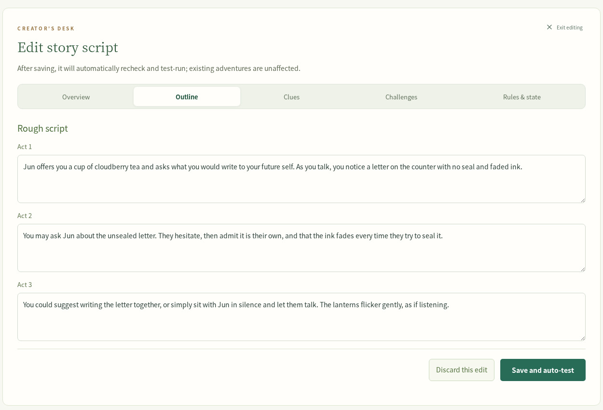

Use generated content as a starting point, then develop the setting at your own level of detail. [Creating and editing](creators.md#edit-and-test).

## Play through conversation and action

Enter an action or speak to an NPC. The engine commits the resulting events and shows dialogue, narration and state changes together. Important characters can have a 2D portrait whose expressions and motion follow committed dialogue. This scene uses an existing portrait included in an imported native package; [Avatar integration](reference/avatars.md) also covers configuring the optional creation worker.

The reference frontend provides the stage; custom applications can render the same backend events in their own style. [Workspace guide](workspace.md).

## Keep memories and explore another choice

Write personal notes, record commitments and search what your character knows. Memory results retain their sources and respect the active character and branch. Fork at an earlier turn to try another direction; each branch keeps its own events and memories.

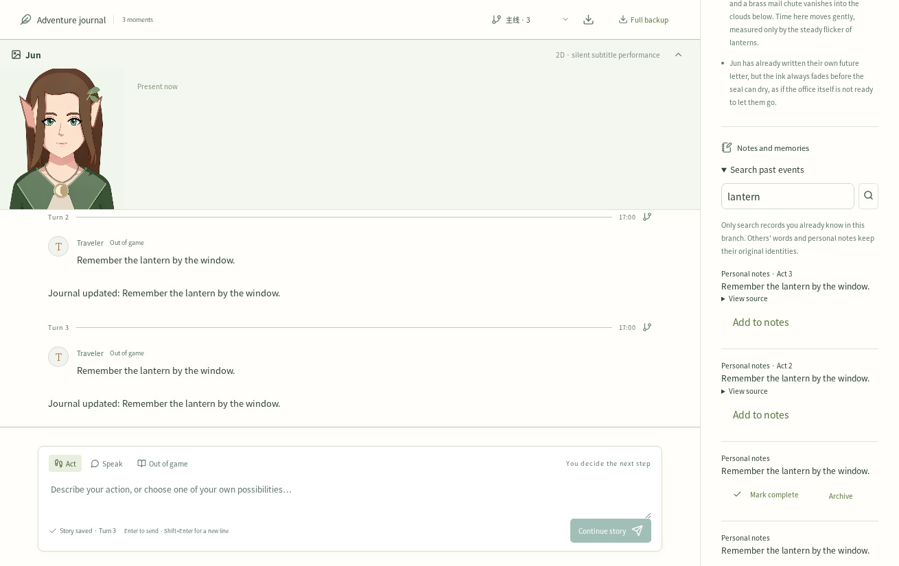

Optional embeddings add semantic retrieval. [Memory interfaces](reference/memory.md) · [Session and branch APIs](reference/api.md).

## Add tabletop rules when your game needs them

Equipment, trading, travel, resources, combat and dice checks share typed actions and recorded outcomes. Inspect rolls and their consequences in the play view. Deterministic rules handle arithmetic and ownership; generation models supply plans, dialogue and narration.

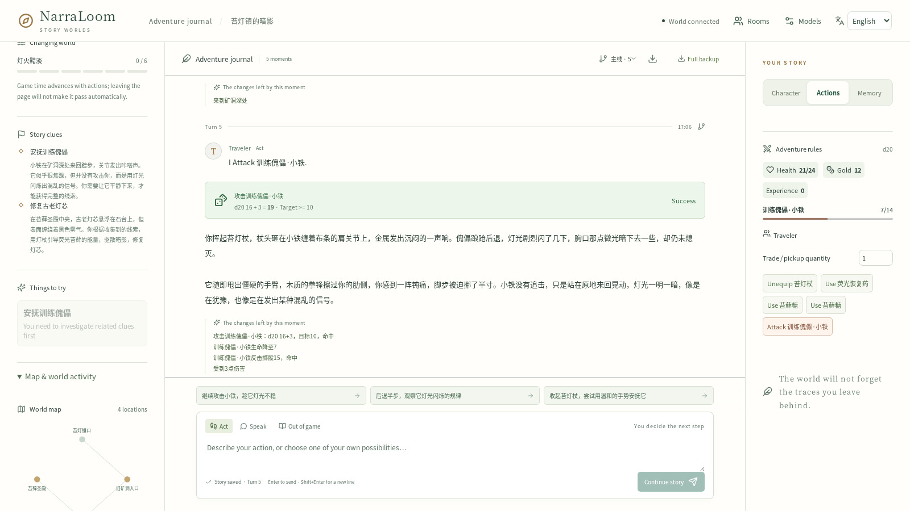

Choose a built-in check system or register your own Python implementation. [Game rules](reference/rules.md) · [Custom dice systems](reference/check-engines.md).

## Let the world act

Enable world activity to give NPCs goals, schedules and actions of their own. The world panel exposes current activity and pause/resume controls. Use this for inhabited locations and ongoing situations alongside player turns.

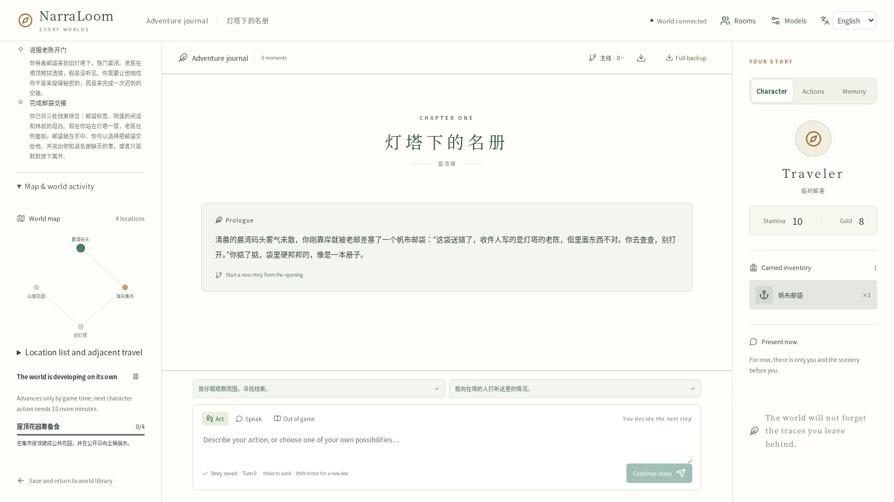

[World rules and activity](reference/rules.md).

## Build smaller games with custom state

Integers, switches, phases, conditions and triggers can express a puzzle, relationship system or progress-based story. In this example, a clock-tower mystery exposes calibration progress and a note-sorting action. Authors edit the mechanics; automatic tests exercise declared acceptance routes.

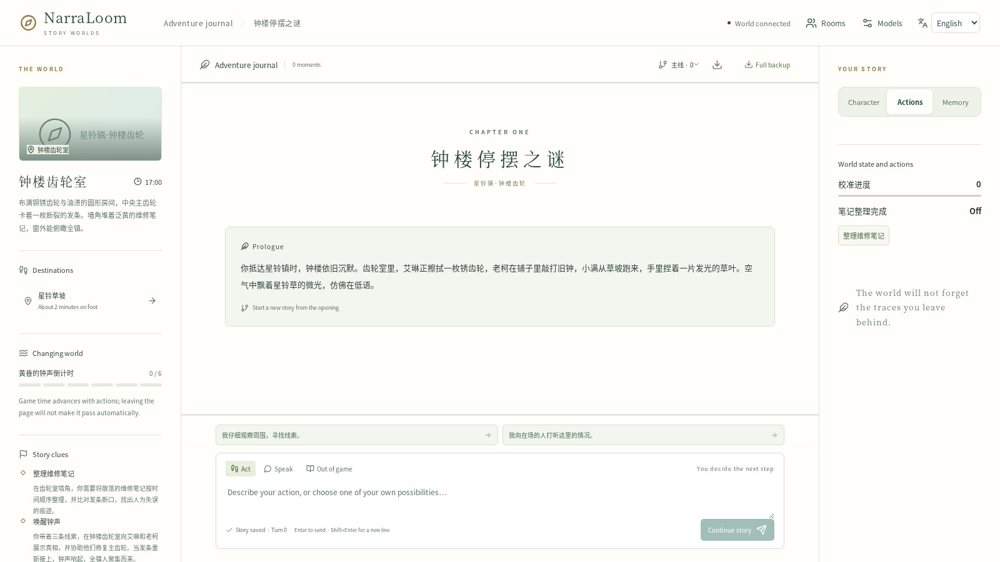

Python action modules can add richer typed actions, shared state and character-specific state. [State mechanics](reference/state-rules.md) · [Action modules](reference/action-modules.md).

## Play together with separate characters

Create a room, invite another player and choose independent characters or shared control. The room tracks whose turn it is, character assignment, private conversation and player trades. Each player receives the information visible to their character. Trades use an explicit offer and confirmation.

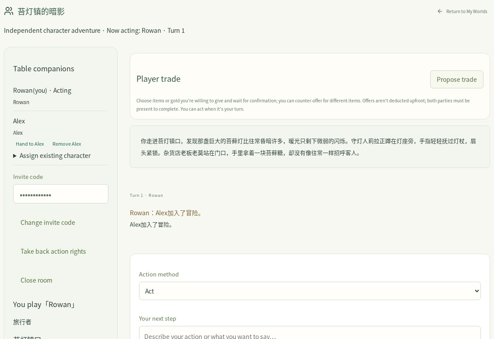

[Room operations](reference/api.md) · [Player projections](reference/contracts.md).

## Share worlds and stories; continue saved adventures

Build a native package with selected stories, creator credits, terms and optional 2D assets. Download it, share a link or publish it on your server's shelf. Recipients install editable copies and test them with their own models. Use full campaign backups to restore progress and player-note exports to share a character's visible experience.

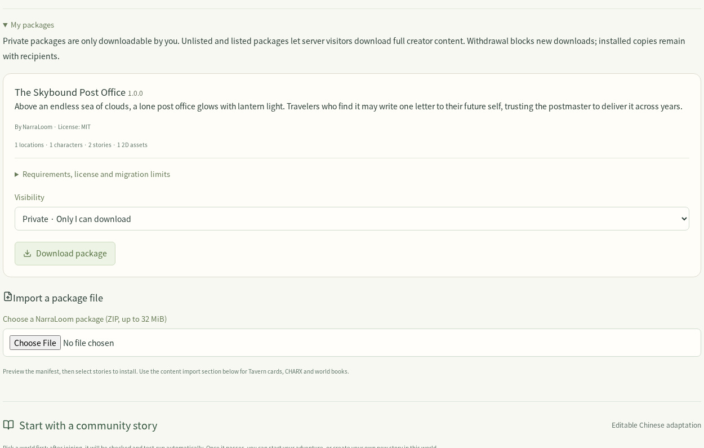

The world library also provides starter stories. Basic character-card, CHARX and world-book imports have a review step. [Package format and import](reference/community-packages.md) · [Backup and deployment](deployment.md).

## Choose models by responsibility

Bind world creation, story creation, planning, NPC dialogue, narration, content review and memory to suitable engines. A capable generator handles complex writing and planning; smaller models can handle narrower tasks. Local services, remote APIs and registered Python adapters use the same module contracts.

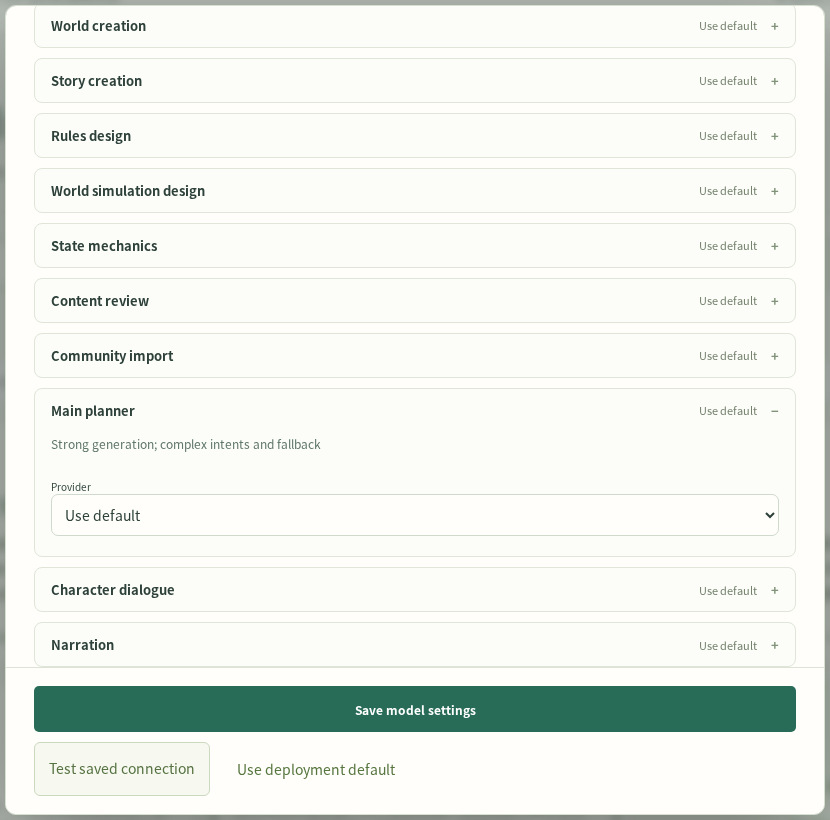

Optional System One/Jev decision adapters and embedding services have their own configuration and deployment requirements. The video shows their configuration forms. Use task evaluations to choose routing thresholds and compare models. [Model recommendations](models.md) · [Engine interfaces](reference/engines.md).

## Build a frontend, extend the engine, compare models

Install the Python backend independently, embed the ASGI app, or use the HTTP API and async Python SDK. The reference frontend uses those same public interfaces. Extensions can provide generation/decision adapters, dice checks, gameplay actions or memory embeddings.

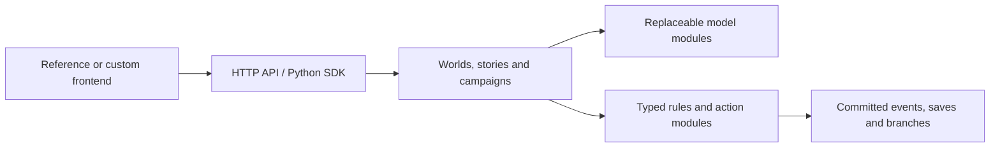

Researchers can freeze tasks, replace one module, evaluate assertions, latency and token usage, then compare configurations. Campaign playtests support checkpoints, resume and actor-specific memory probes. The usage view exposes provider-reported token totals and configurable cost estimates.

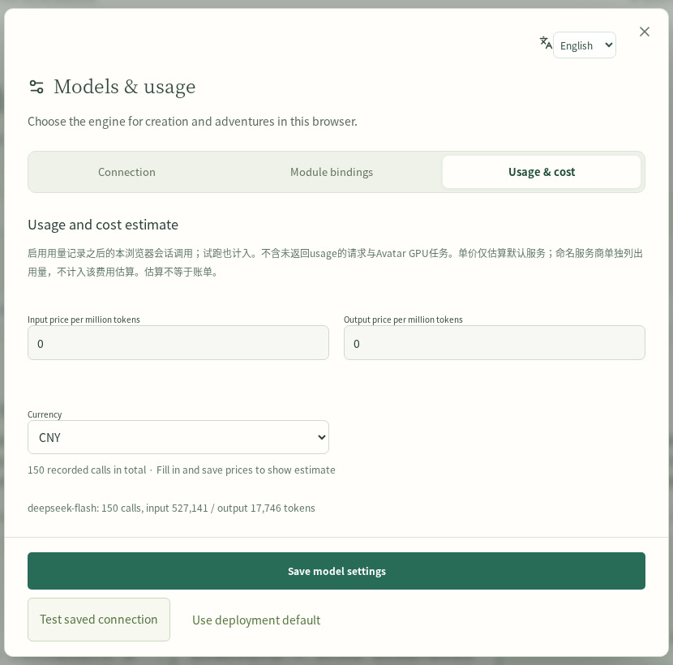

[Backend integration](developers.md) · [SDK example](reference/client.md) · [Evaluation](research.md) · [Campaign playtesting](reference/playtesting.md).

[Start your first world](quickstart.md) · [All guides](index.md) · [Watch the 4:10 tour](../README.md)
