# NarraLoom 図解ツアー

[English](../features.md) · [简体中文](../zh-CN/features.md) · [日本語](features.md)

同じモジュール式バックエンドで、短い会話シーン、インタラクティブな物語、テーブルトーク型の冒険を作れます。リファレンス画面を通して、世界の構想からプレイ、共有、モデル研究までを紹介します。画像を開くと原寸で確認できます。

| 知りたい機能 | 4:10 の動画内の位置 |
| --- | --- |
| [モデル接続](#connect) · [作成と自動テスト](#create) | 0:04 · 0:14 |
| [世界と複数の物語](#worlds) · [編集](#author) | 0:34 |
| [NPC との会話](#play) · [記憶と分岐](#memory) | 1:03 |
| [RPG ルール](#rules) · [世界の活動](#simulation) · [独自状態](#state) | 1:33 |
| [マルチプレイ](#rooms) · [共有と復元](#share) | 2:27 · 2:43 |
| [モデルの割り当て](#engines) · [開発と研究](#build) | 3:08 · 3:35 |

[動画を見る](../../README.ja.md) · [インストールして試す](quickstart.md)

## ローカルモデルや API に接続

モデル設定画面でプロトコル、接続先、モデル ID を指定し、保存して接続を確認します。まず共通のモデルで始め、後からモジュールごとに変更できます。画面は英語・簡体字中国語・日本語に対応し、作品の言語は別に選択します。

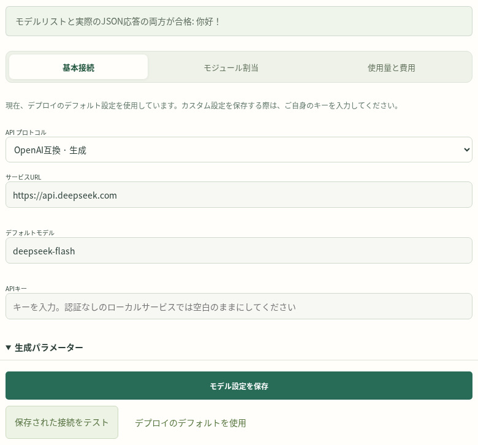

[モデルの選択](models.md) · [AI によるセットアップ](ai-setup.md)。

## 構想から、テスト済みの世界へ

世界の作成画面で、舞台と最初の物語を記述します。一つの場所と一人の NPC からなるシーン、短編、探索型の冒険を選べます。RPG ルール、世界の活動、独自状態、2D 素材も追加できます。エンジンは編集可能な場所・人物・物語を生成し、構造検証、ルール検証、独立したセーブでのモデル試走を行います。

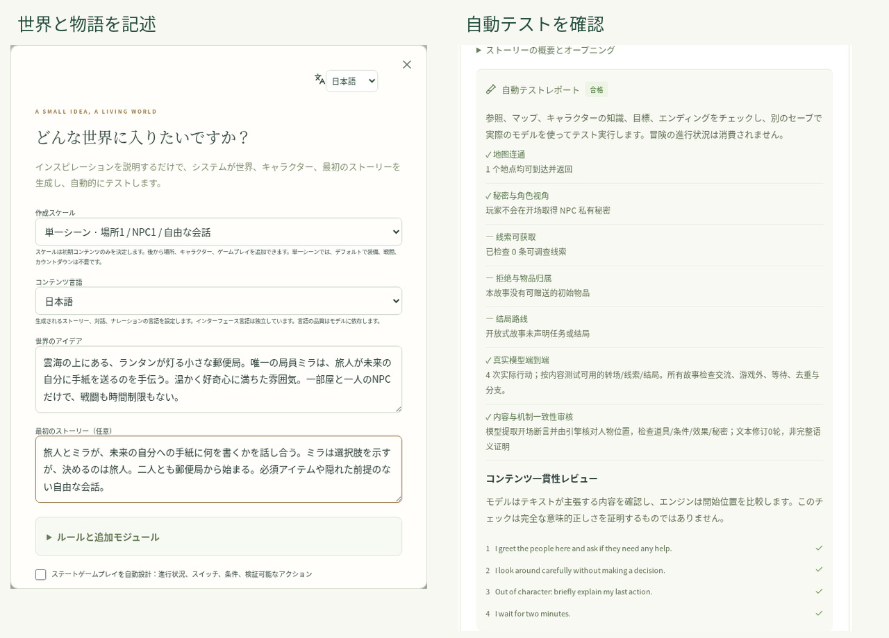

テスト結果は検証した版に紐付きます。結果を確認し、自分で編集するか、AI に修正と再テストを依頼できます。[クリエイター向けガイド](creators.md)。

## 一つの世界に複数の物語

世界は共通の場所や登場人物を持ち、物語は前提、プレイヤーの役割、導入、あらすじを持ちます。キャンペーンは実際のプレイを保存します。既存の世界で新しい物語を作成すると、同じ舞台で別の展開を始められます。画像では二つの物語がそれぞれテスト済みです。

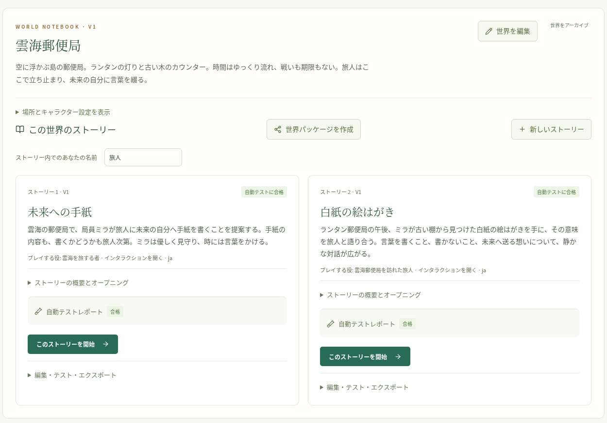

独立して開始するほか、同じ世界の版で、以前の冒険から引き継ぎ可能な結果を持ち越せます。[世界と物語の作成](creators.md)。

## 文章と仕組みを編集

世界の編集では場所、接続、人物の性格・目標・知識を扱います。物語の編集は概要、幕、手がかり、課題、仕組みに分かれています。保存すると新しい版を作成して再テストし、既存のキャンペーンは固定済みの内容を使い続けます。

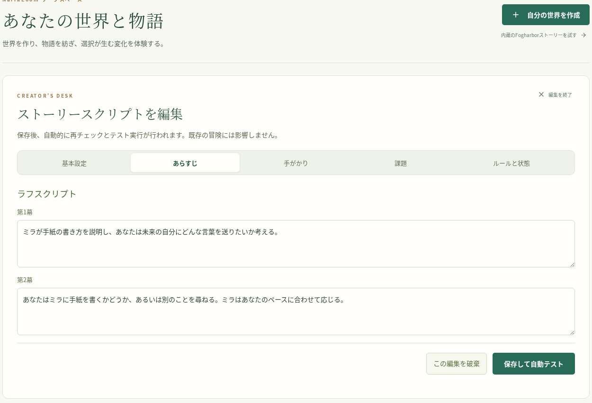

生成した内容を出発点に、好みの深さまで作品を作り込めます。[作成と編集](creators.md)。

## 会話と行動で物語を進める

行動を入力したり NPC に話しかけたりすると、確定したイベントに基づいて会話、語り、状態の変化が表示されます。主要人物には、台詞に合わせて表情や動きが変わる 2D 素材を割り当てられます。このシーンはネイティブパッケージの既存素材を使用しています。[Avatar 連携](../reference/avatars.md)では、任意のキャラクター生成サービスの設定も紹介しています。

独自アプリでは、同じバックエンドのイベントを使って別の演出を作れます。[ワークスペースガイド](workspace.md)。

## 記憶を残し、別の選択を試す

個人メモや約束を記録し、キャラクターが知っている内容を検索できます。結果には出典が残り、現在のキャラクターと分岐の可視範囲が適用されます。以前のターンから分岐を作ると、イベントと記憶を分けて別の展開を試せます。

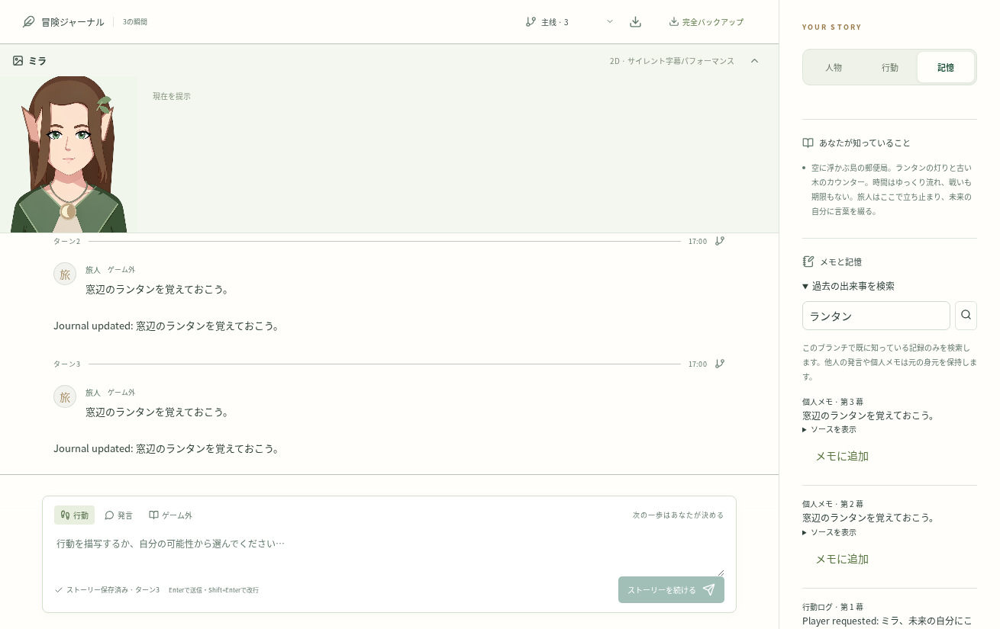

埋め込みモデルを追加すると意味検索も利用できます。[記憶インターフェース](../reference/memory.md) · [セーブと分岐の API](../reference/api.md)。

## ゲームに合う RPG ルール

装備、取引、移動、資源、戦闘、ダイス判定は、型付きの行動と結果記録を共有します。プレイ画面で出目と結果を確認できます。計算や所有権は決定的なルールで処理し、生成モデルが計画、会話、語りを担当します。

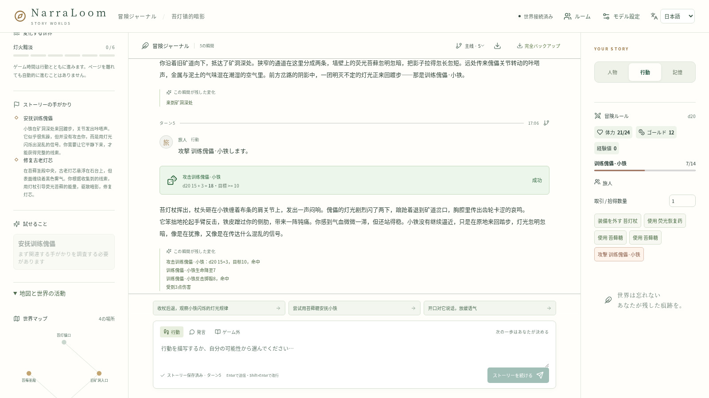

組み込みの判定方式を選ぶほか、独自の Python 実装も登録できます。[ゲームルール](../reference/rules.md) · [独自の判定方式](../reference/check-engines.md)。

## 世界を自律的に動かす

世界の活動を有効にすると、NPC が目標、予定、自分の行動を持ちます。世界パネルから現在の活動を確認し、一時停止や再開を操作できます。プレイヤーのターンとともに、住人の生活や状況の変化を表現できます。

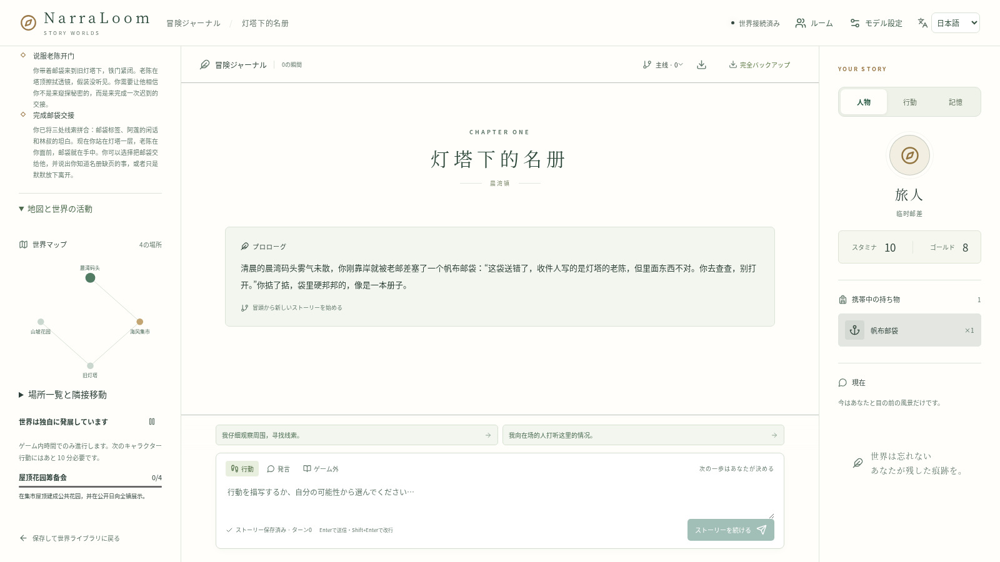

[世界のルールと活動](../reference/rules.md)。

## 独自状態で小さなゲームを作る

整数、スイッチ、段階、条件、トリガーで、パズルや関係の変化、進捗型の物語を表せます。画像の時計塔の謎には、調整の進捗と整備メモを整理する行動があります。作者が仕組みを編集し、自動テストが宣言済みの受け入れ経路を実行します。

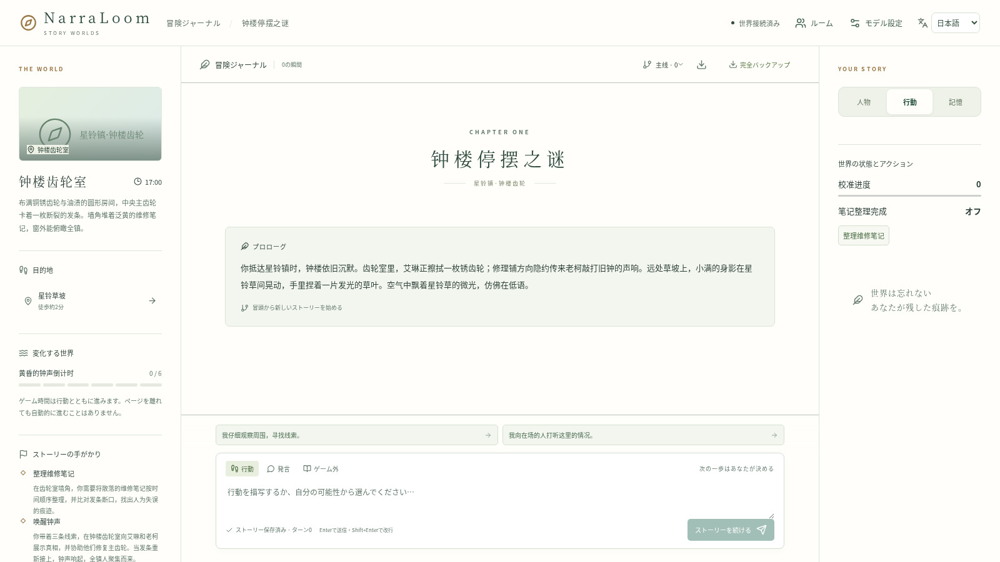

Python の行動モジュールで、共有状態やキャラクター別の状態も拡張できます。[状態ルール](../reference/state-rules.md) · [行動モジュール](../reference/action-modules.md)。

## 別々のキャラクターで一緒に遊ぶ

部屋を作って仲間を招待し、独立したキャラクターか共有操作を選びます。部屋では手番、キャラクターの割り当て、内緒話、プレイヤー間の取引を扱います。各プレイヤーには、自分のキャラクターから見える情報が届きます。取引は提案と相手の確認で成立します。

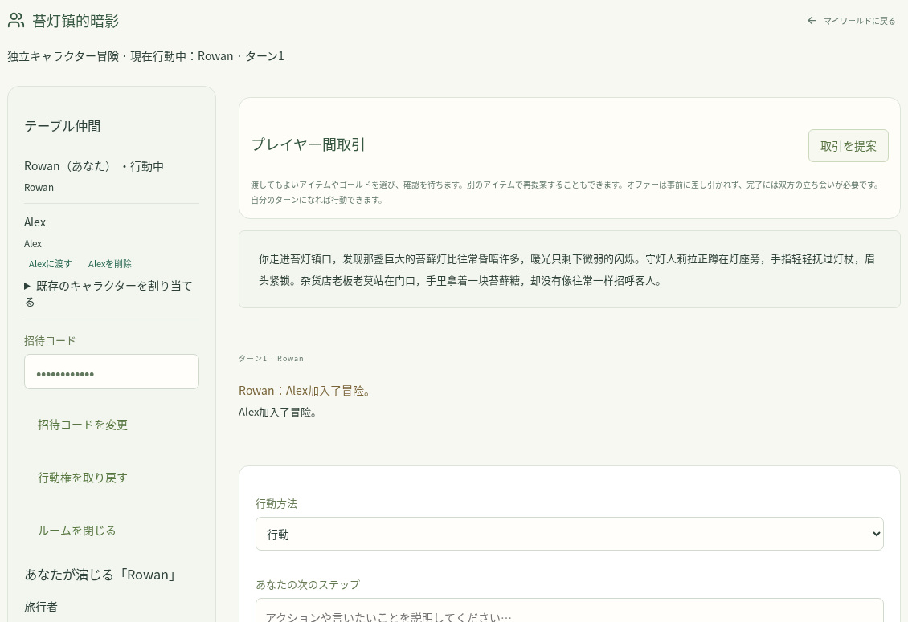

[部屋の API](../reference/api.md) · [キャラクターの視点](../reference/contracts.md)。

## 作品を共有し、冒険を復元

選んだ物語、作者名、利用条件、任意の 2D 素材をネイティブパッケージにまとめます。ファイルのダウンロード、リンク共有、自分のサーバーの本棚への公開が可能です。受け取った人は編集可能なコピーをインストールし、自分のモデルでテストします。キャンペーン全体のバックアップで進行を復元でき、プレイヤーメモの書き出しで見えた体験を共有できます。

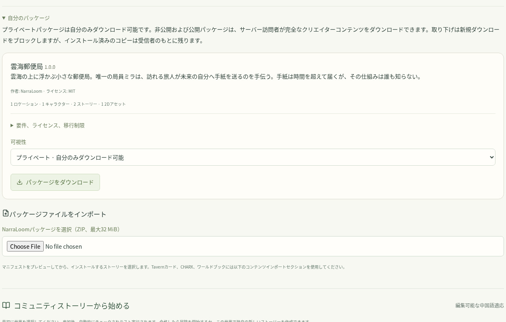

世界ライブラリにはスターター作品もあります。基本的なキャラクターカード、CHARX、ワールドブックには確認付きのインポート経路があります。[パッケージ形式](../reference/community-packages.md) · [バックアップと運用](deployment.md)。

## 役割ごとにモデルを選択

世界・物語の作成、計画、NPC の会話、語り、内容レビュー、記憶検索に、それぞれ適したエンジンを割り当てます。複雑な創作や計画には高性能な生成モデルを、範囲の明確な処理には小型モデルを選べます。ローカルサービス、外部 API、登録済み Python アダプターが共通の契約を利用します。

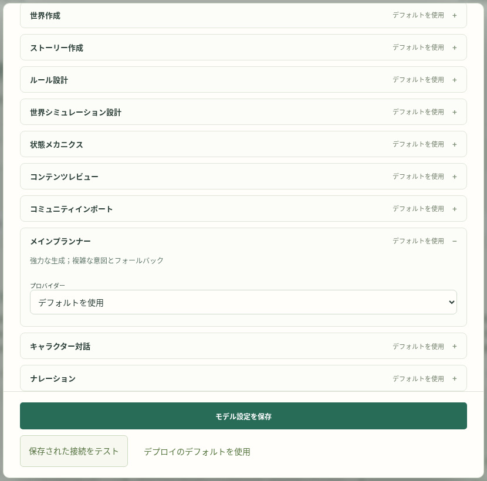

任意の System One/Jev 判断アダプターと埋め込みサービスには、それぞれ設定と配置が必要です。動画では設定フォームを紹介しています。タスク評価で振り分けの閾値を選び、モデルを比較できます。[モデル選択の目安](models.md) · [エンジン仕様](../reference/engines.md)。

## フロントエンド、拡張、モデル研究

Python バックエンドを単独でインストールする、ASGI アプリとして組み込む、HTTP API や非同期 Python SDK で利用する、といった使い方ができます。リファレンス画面も同じ公開 API を使っています。生成・判断アダプター、ダイス判定、ゲーム行動、記憶の埋め込みを拡張できます。

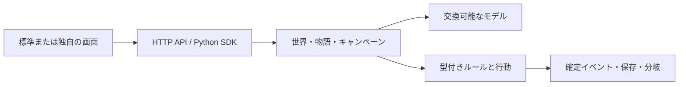

研究者はタスクを固定し、一つのモジュールを置き換えて、正確性、遅延、トークン使用量を比較できます。キャンペーン試走はチェックポイント、再開、キャラクター別の記憶検査に対応します。使用量画面では、サービスが返したトークン数と、設定した単価による費用の見積もりを確認できます。

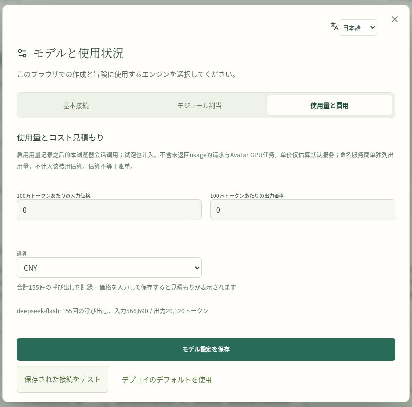

[バックエンド連携](developers.md) · [SDK の例](../reference/client.md) · [モデル評価](research.md) · [キャンペーン試走](../reference/playtesting.md)。

[最初の世界を作る](quickstart.md) · [ガイド一覧](index.md) · [4:10 の動画を見る](../../README.ja.md)
