# NarraLoom 功能图览

[English](../features.md) · [简体中文](features.md) · [日本語](../ja/features.md)

用同一套模块化后端构建单场景对话、互动故事和跑团冒险。这份图览通过参考前端，展示从世界构想到游玩、分享和模型研究的完整路径。点击截图可查看大图。

| 想了解的功能 | 4:10 视频中的位置 |
| --- | --- |
| [连接模型](#connect) · [创建与自动测试](#create) | 0:04 · 0:14 |
| [一个世界，多个故事](#worlds) · [编辑内容](#author) | 0:34 |
| [NPC 与对话](#play) · [记忆与分支](#memory) | 1:03 |
| [跑团规则](#rules) · [主动世界](#simulation) · [自定义状态](#state) | 1:33 |
| [多人互动](#rooms) · [分享与恢复](#share) | 2:27 · 2:43 |
| [模型模块](#engines) · [后端与研究](#build) | 3:08 · 3:35 |

[观看视频](../../README.zh-CN.md) · [安装并体验](quickstart.md)

## 连接本地模型或 API

打开“模型与用量”，选择服务协议、填写地址与模型 ID，保存并测试连接。先配置一个默认模型即可开始，之后可为各模块分别选择模型。界面支持英文、简体中文和日文；世界内容的语言单独选择。

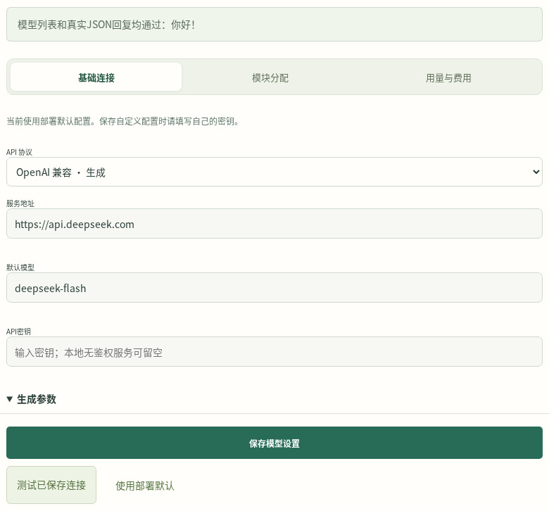

继续阅读[模型选择](models.md)，或使用 [AI 辅助安装](ai-setup.md)。

## 描述构想，自动创建并试跑

选择“创建我的世界”，描述世界设定与首个故事。可以从一个地点、一个 NPC 的小场景开始，也可以选择短篇故事或探索冒险；创建时可选跑团规则、主动世界、自定义状态和 2D 形象。引擎生成可编辑的地点、人物与剧本，再自动进行结构检查、规则检查和隔离存档中的模型试跑。

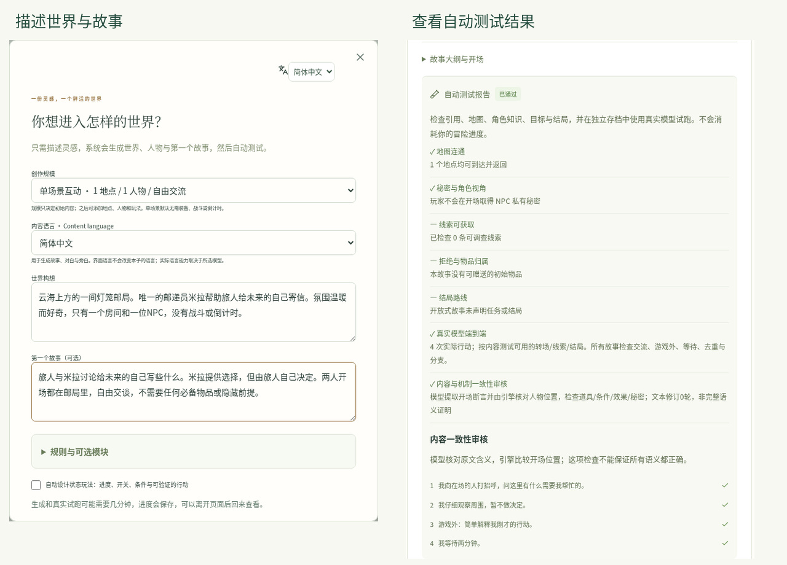

测试报告绑定具体内容版本。查看结果后，可以自己编辑，也可以请求 AI 修订并重测。[创作者指南](creators.md)。

## 让同一个世界发生多个故事

世界保存共用的地点与常驻人物；每个故事定义自己的前提、玩家身份、开场和大纲；每份冒险存档记录一次实际游玩。打开已有世界并选择“新建故事”，即可根据新的构想生成另一个故事。图中两个故事共享同一个世界，各自通过独立测试。

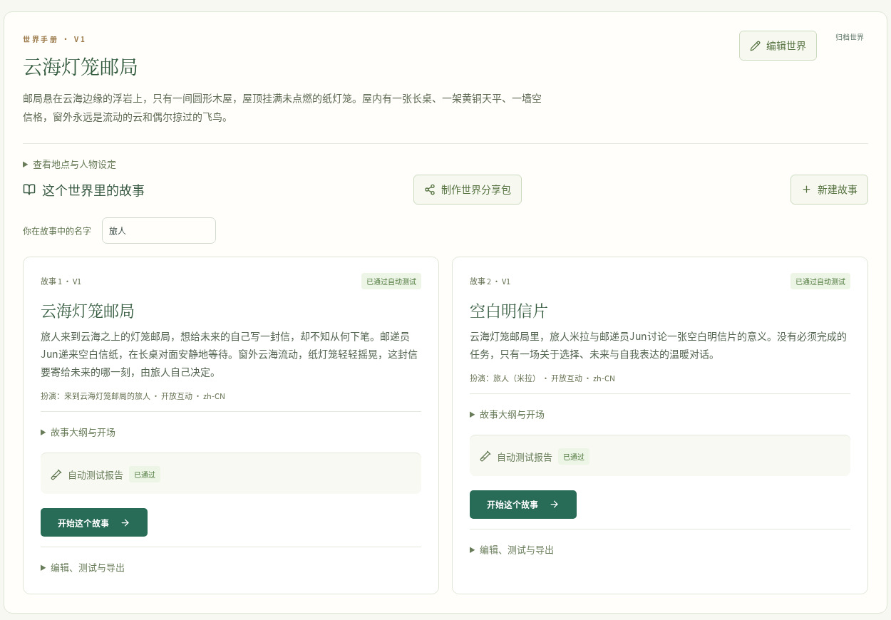

故事可以独立开局，也可以在同一世界版本内继承先前冒险允许延续的后果。[世界、故事与连续游玩](creators.md)。

## 深入编辑文字和机制

世界编辑器管理地点、连接关系、人物性格、目标与知识；故事编辑器按基本设定、大纲、线索、挑战和机制分组。保存修改会产生新版本并重新测试，已有冒险继续使用原先固定的内容。

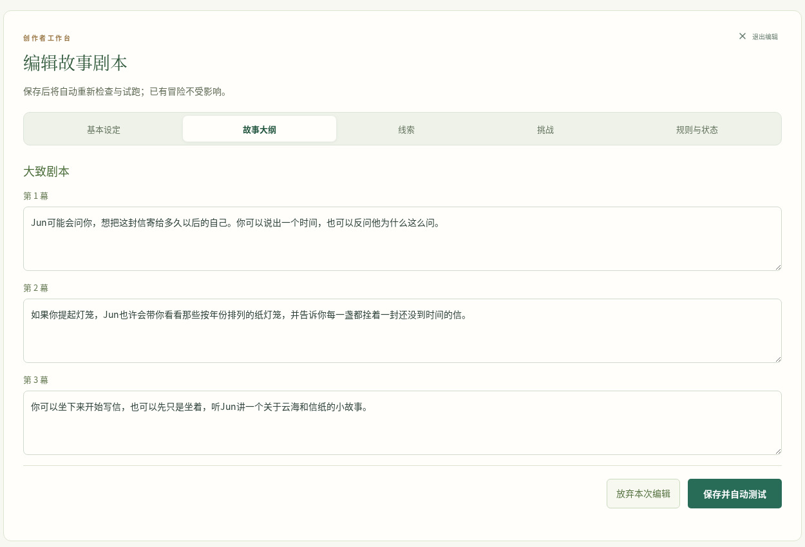

从生成内容起步，再按自己的创作习惯完善细节。[创作与编辑](creators.md)。

## 通过对话与行动推动故事

输入行动或与 NPC 交谈，引擎提交事件后一起展示对白、叙述和状态变化。重要人物可绑定 2D 形象，由已提交的对白驱动表情与动作。图中的人物使用原生分享包携带的已有形象；[Avatar 接口](../reference/avatars.md)也介绍了可选角色创建服务的配置。

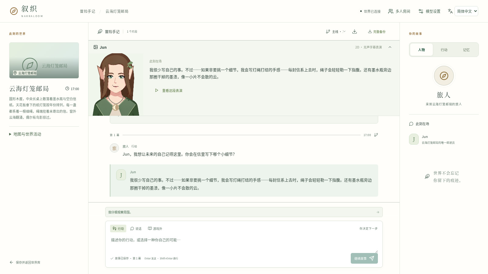

参考前端提供舞台，自定义应用也能用同一组后端事件实现自己的呈现方式。[工作台指南](workspace.md)。

## 保存记忆，探索另一种选择

记录个人手记与约定，检索角色已经知道的内容。记忆结果保留来源，并按当前角色和分支限定可见范围。从之前的回合创建分支，可以尝试另一条故事走向；不同分支各自保留事件与记忆。

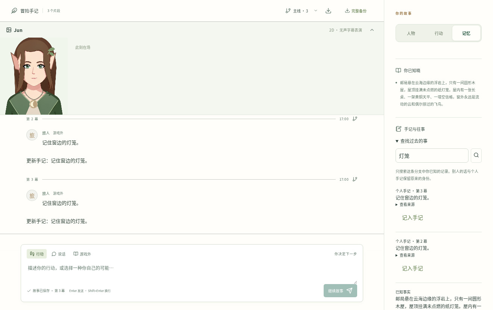

可选的嵌入模型为记忆检索增加语义匹配。[记忆接口](../reference/memory.md) · [存档与分支 API](../reference/api.md)。

## 为需要的游戏加入跑团规则

装备、交易、移动、资源、战斗和掷骰共用类型化行动与结果记录。游玩时可直接查看骰点及其后果；数值计算和物品归属由确定性规则处理，生成模型负责计划、对白与叙述。

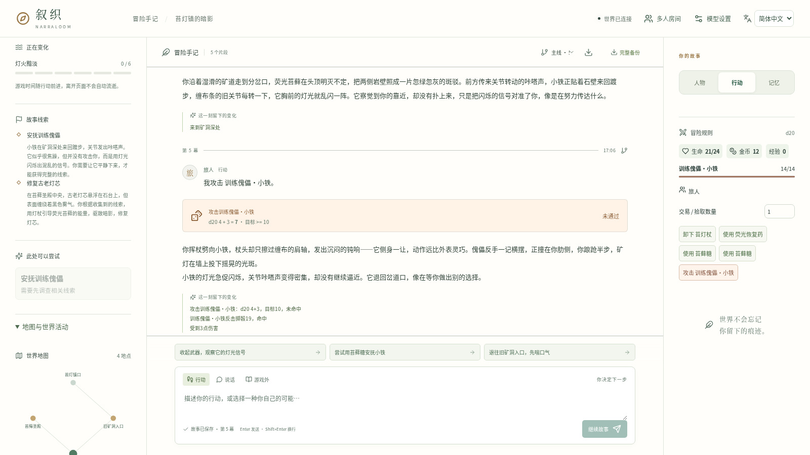

可以选用内置检定系统，也可以注册自己的 Python 实现。[跑团规则](../reference/rules.md) · [自定义检定](../reference/check-engines.md)。

## 让世界主动运转

开启世界活动，为 NPC 提供目标、日程和自主行动。世界面板展示当前活动，并提供暂停与继续控制。它适合表现有人物生活、局势持续变化的场景，与玩家回合共同推进世界。

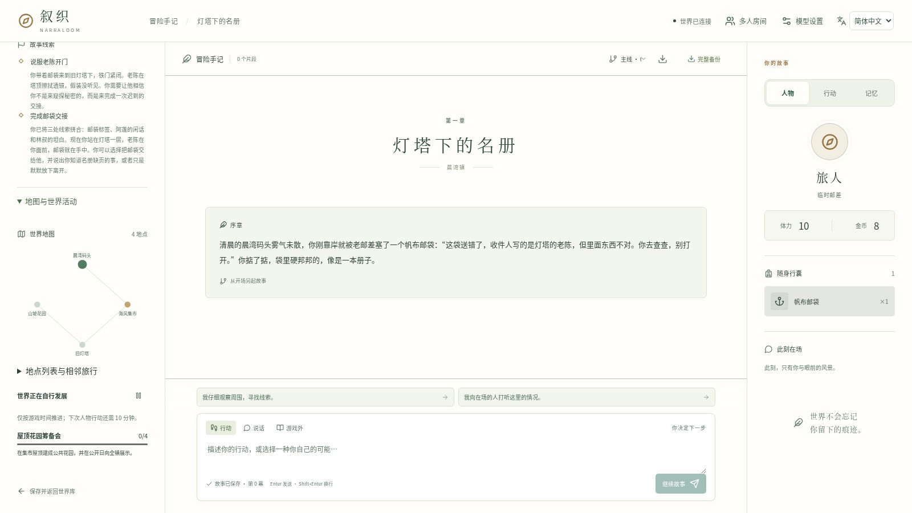

[世界规则与活动](../reference/rules.md)。

## 用自定义状态做轻量玩法

用整数、开关、阶段、条件和触发器描述解谜、关系变化或进度型故事。图中的钟楼谜题包含“校准进度”和“整理维修笔记”行动。作者可以编辑这些机制，自动测试会执行声明的验收路线。

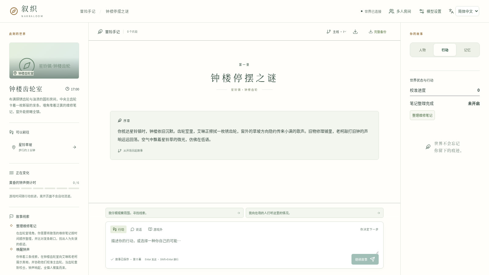

Python 玩法模块还能扩展更丰富的行动、共享状态与角色专属状态。[状态机制](../reference/state-rules.md) · [行动模块](../reference/action-modules.md)。

## 多人扮演不同角色

创建房间并邀请伙伴，选择独立角色或共用角色。房间管理当前行动者、人物分配、私语和玩家交易；每位玩家只接收自身角色可见的信息。交易通过提出报价和对方确认完成。

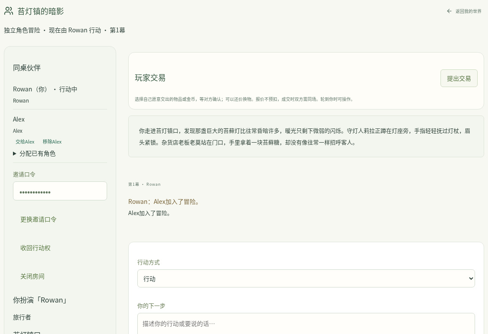

[房间操作](../reference/api.md) · [角色视角](../reference/contracts.md)。

## 分享创作，恢复与延续冒险

把选定故事、作者署名、使用条款和可选的 2D 资源打成原生分享包。可以下载文件、分享链接，或放到自己服务器的社区书架。接收者安装后得到可编辑副本，并用自己的模型重新测试。完整冒险备份用于恢复进度；玩家手记导出用于分享角色可见的经历。

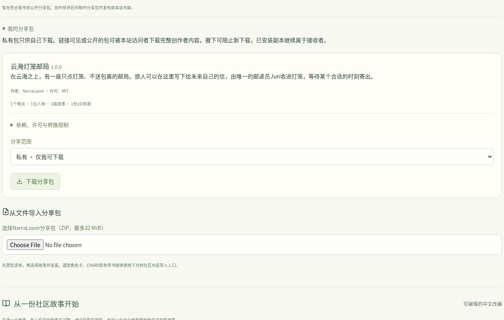

世界库还提供初始故事；基础角色卡、CHARX 和世界书可以通过导入审核流程转换。[包格式与导入](../reference/community-packages.md) · [备份与部署](deployment.md)。

## 按职责选择模型

世界创建、故事生成、主持规划、角色对白、叙述、内容审核和记忆检索可以分别绑定引擎。复杂创作与规划可使用能力较强的生成模型，范围明确的任务可选更小的模型。本地服务、远程 API 和注册的 Python 适配器共享模块契约。

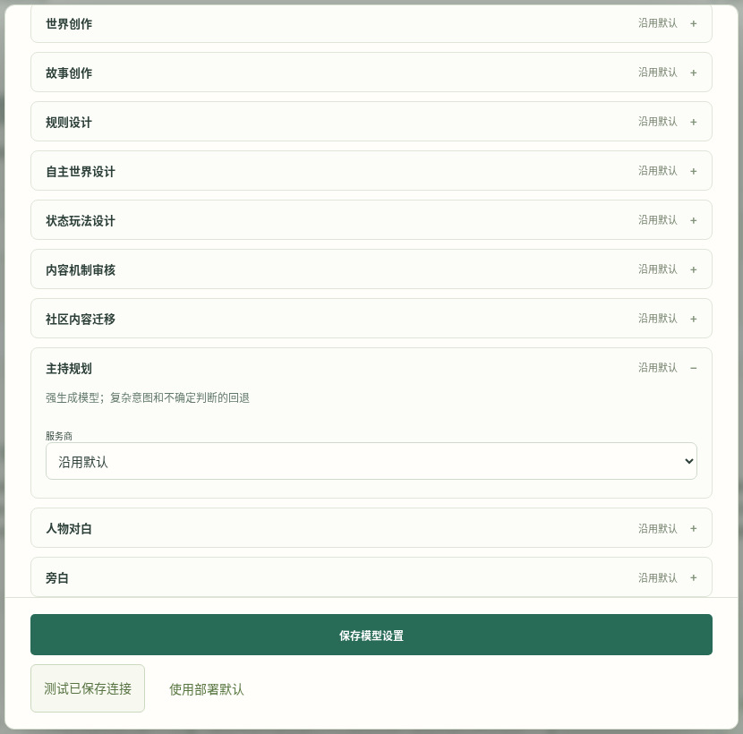

可选的 System One/Jev 判断适配器和嵌入服务有独立的配置与部署要求；视频展示其配置界面。通过任务评测选择路由阈值并比较模型。[模型建议](models.md) · [引擎接口](../reference/engines.md)。

## 开发前端、扩展玩法、比较模型

可独立安装 Python 后端，嵌入 ASGI 应用，或通过 HTTP API 与异步 Python SDK 调用。参考前端使用同一套公开接口。扩展模块可以提供生成与判断适配器、掷骰检定、玩法行动或记忆嵌入。

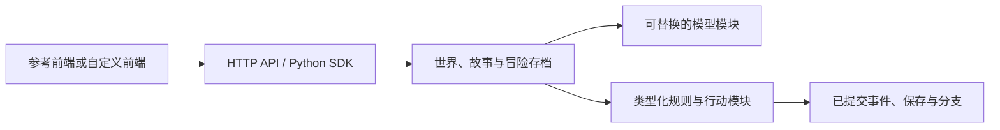

研究者可以固定任务，替换一个模块，评估正确性、延迟与 token 用量，再比较配置。连续冒险测试支持检查点、恢复执行与角色记忆探针；用量页面显示服务商返回的 token 统计，并可设置单价估算费用。

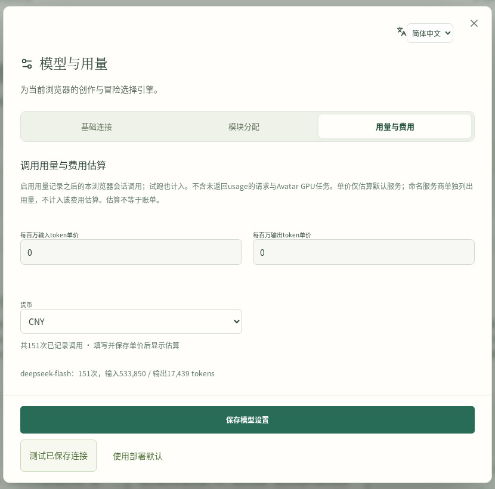

[后端集成](developers.md) · [SDK 示例](../reference/client.md) · [模型评测](research.md) · [连续冒险测试](../reference/playtesting.md)。

[创建第一个世界](quickstart.md) · [全部指南](index.md) · [观看 4:10 演示](../../README.zh-CN.md)
